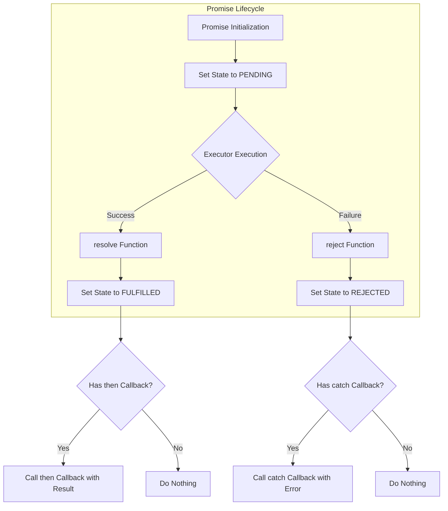

# Lesson 07: TypeScript Promises - DoorDash Restaurant Ordering

This lesson demonstrates the use of **Promises** and **async/await** in TypeScript through a mock restaurant ordering application inspired by DoorDash.

## Overview

This project is a terminal-based application that simulates the behavior of processing food delivery orders asynchronously. It showcases:

- **Promise chaining** with `.then()` and `.catch()`
- **Promise.allSettled()** for handling multiple concurrent orders
- **Async/await** syntax for cleaner asynchronous code
- Custom error handling with `RestaurantError`
- Real-time status updates through callbacks
- Terminal UI using the `blessed` library

---

## What is a Promise?

A promise is an object that represents the eventual completion (or failure) of an asynchronous operation and its resulting value. It allows you to handle asynchronous operations in a more elegant and structured way, avoiding callback hell and providing a cleaner syntax for chaining asynchronous tasks.

Below is a Mermaid diagram that visualizes the promise processing flow:



---

## Installation

To run the program, you need to have Node.js installed on your system. You can download it from the official website: [Node.js](https://nodejs.org/).

After installing Node.js, navigate to this directory and install the necessary dependencies:

```bash
npm install
```

---

## Running the Application

To start the application, run the following command:

```bash
npm start
```

Or alternatively:

```bash
ts-node src/DoorDash.ts
```

The application will start in the terminal, displaying a menu of food items that you can order. You can interact with the application by pressing the following keys:

- **1-9**: Select dishes by pressing the corresponding number.
- **o**: Place the order.
- **q**: Quit the application.

---

## Order Processing with Promises

The `OrderProcessor` class is responsible for simulating the various stages of processing an order. Each stage is represented by an asynchronous method that returns a Promise. The stages include:

1. **restaurantConfirmed**: Simulates the restaurant confirming the order.
2. **restaurantWorking**: Simulates the restaurant preparing the order.
3. **deliveryPersonPickedUp**: Simulates the delivery person picking up the order.
4. **deliveryComplete**: Simulates the delivery being completed.

Here is an example of the `processOrder` method in `OrderProcessor`:

```typescript
processOrder(): Promise<string> {
    return this.restaurantConfirmed()
        .then((confirmed) => {
            if (!confirmed) {
                throw new RestaurantError(this.item, 'Restaurant Rejected.');
            }
            return this.restaurantWorking();
        })
        .then((complete) => {
            if (!complete) {
                throw new RestaurantError(this.item, 'Restaurant Incomplete.');
            }
            return this.deliveryPersonPickedUp();
        })
        .then((pickedUp) => {
            if (!pickedUp) {
                throw new RestaurantError(this.item, 'Delivery Rejected.');
            }
            return this.deliveryComplete();
        })
        .then((delivered) => {
            if (!delivered) {
                throw new RestaurantError(this.item, 'Delivery Lost.');
            }
            return this.item;
        })
        .catch((error) => {
            this.statusCallback(this.item, `Order failed: ${error.message}`);
            throw error; // Re-throw the error to reject the promise
        });
}
```

---

## Using `Promise.allSettled` in `DoorDash.ts`

In `DoorDash.ts`, the `Promise.allSettled` method is used to wait for all the order processing promises to complete before determining which orders succeeded and which failed. This ensures that we get a complete picture of the order processing results.

However, because we use a callback function to update the status of each order, we get early failure messages as soon as an order fails at any stage. This provides real-time feedback on the status of each order.

Here is an example of how `Promise.allSettled` is used in `DoorDash.ts`:

```typescript
// Create an array of promises for processing each item
const promises = itemsToProcess.map(item => {
    const processor = new OrderProcessor(item, updateStatus);
    return processor.processOrder();
});

// Wait for all promises to resolve
const results = await Promise.allSettled(promises);

let summaryMessage = 'Successfully delivered:\n*****************\n';
let summaryTitle = 'Status: Complete';

// Check for fulfilled promises
const fulfilledItems = results.filter(result => result.status === 'fulfilled');

if (fulfilledItems.length === 0) {
    summaryMessage = '';
}

fulfilledItems.forEach(result => {
    const { value } = result as any;
    summaryMessage += `${value}\n`;
});

// Check for rejected promises
const rejectedItems = results.filter(result => result.status === 'rejected');

if (rejectedItems.length > 0) {
    summaryMessage += '*****************\nFailed to deliver:\n*****************\n';
    rejectedItems.forEach(result => {
        const { reason } = result as any;
        const item = reason.item;
        const explanation = reason.explanation;
        summaryMessage += `${item}: ${explanation}\n`;
    });
    summaryTitle = 'Status: Incomplete';
}
```

In this example, `Promise.allSettled` is used to wait for all the order processing promises to complete. The results are then checked to determine which orders succeeded and which failed. The callback function `updateStatus` provides real-time feedback on the status of each order as it progresses through the various stages.

---

## Key Features

- **Random delays**: Each order processing stage has a random delay between 2-6 seconds
- **15% failure probability**: Each stage has a 15% chance of failing to simulate real-world scenarios
- **Status callbacks**: Real-time updates show the progress of each order
- **Promise chaining**: Demonstrates the `.then()` syntax for sequential async operations
- **Error handling**: Custom `RestaurantError` class for better error messages

---

## Class Exercise

**Refactor the `processOrder` method in `OrderProcessor.ts` so that it uses `async/await` instead of chained promises.**

This will help you understand the difference between promise chaining and async/await syntax, and how they can both accomplish the same asynchronous flow.

---

## Conclusion

This project demonstrates the use of `Promises` and `async/await` in TypeScript to handle asynchronous operations in a terminal-based application. By using `Promise.allSettled`, we can wait for all promises to complete before determining the overall results, while still providing real-time feedback through callback functions.


