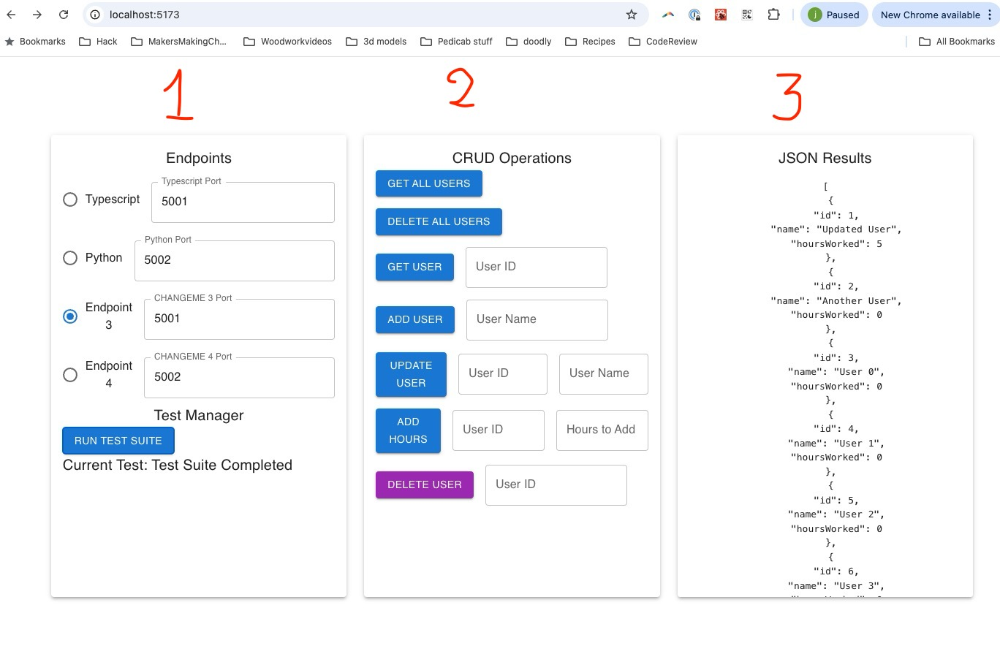

# REST-MULTI-LANGUAGE.md

## Assignment: Implement a RESTful API in Multiple Languages (in addition to typescript and python)

## Class exercise
we will implement the server in rust so you in class so you can experience the process.   This, unfortunately, means that you cannot choose rust as one of your languages for this assignment.

### Languages That Cannot Be Used
The following languages are **not allowed** for this assignment:
- **Rust** (we will implement this together in class)
- **Javascript**
- **Python** (already provided)
- **Typescript** (already provided)
- **Java**

### Objective
Your assignment is to extend the existing project by implementing two additional servers that replicate the functionality of the TypeScript server and the Python server that implement the routes in `ROUTES.md`. This will allow you to explore RESTful API implementation in multiple programming languages and understand how each language approaches backend server development.

### Purpose of This Assignment
The primary goals of this assignment are to:
1. **Learn that REST is language independent** - By implementing the same API in multiple languages, you'll understand that REST principles transcend any specific programming language.
2. **Practice specification-driven development with LLM** - You'll learn how to use generative AI tools effectively to build software from specifications, a valuable skill for modern software development.

### Repository Setup
This entire directory can be copied into your team's GitHub repository under `submissions/rest-server-assignment`.

### Setup Instructions

#### Run the Client Tester
The client application will allow you to test the functionality of the server.
- To run the client tester,
- Clone the repository then cd into the directory
- use the command:
  ```bash
  npm install
  npm run dev
  ```
- The client is set up to communicate with the TypeScript server on **port 5001** and the Python server on **port 5002**.

- In the left panel you can set the port numbers for your two servers. 
  - You can see that the typescript and python servers are already set up, and you cannot change them.  
  - You will need to add two more servers to the tester and set the port numbers for those servers.  
  - You will also need to update the code in the tester to indicate what languages you chose.  
    - Search for `CHANGEME` in the code to find where to make the changes.
- In the middle panel you can test inidividual routes to your server
- In the right panel you can see the response text (if it is an error) or the response data (if it is a success).


#### Run the TypeScript Server
The TypeScript server is located under `src/servers/ts-server/`.
- To start the server, run the following command:
  ```bash
  ts-node src/servers/ts-server/server.ts
  ```
- Make sure that the server is running on **port 5001**.

#### Run the Python server
The Python server is located under `src/servers/python-server/`

Instructions for setting up and running the Python server can be found in the `README.md` file in the `src/servers/python-server` directory
- Ensure that the client is communicating with the Python server by setting the **port to 5002**. (it is set up this way)

#### Routes for the server.
- All routes for the server are documented in the file ROUTES.md


#### Test CRUD Operations
- Use the fields in the client application to enter parameters for different CRUD operations.
- You can test the following endpoints:
  - **GET all users**
  - **GET user by ID**
  - **POST new user**
  - **PUT (update) user by ID**
  - **PATCH (add hours) for user by ID**
  - **DELETE user by ID**
  - **DELETE all users**

### Test Suite
The test suite implements the following sequence of operations to verify the server's functionality:

1. **Delete All Users**: Ensure that the users list is empty.
2. **Get All Users**: Verify the empty response.
3. **Add a User**: Add a user named "Test User".
4. **Get User by ID**: Retrieve the user and verify the information.
5. **Add Another User**: Add a second user named "Another User".
6. **Update User by ID**: Update the first user's name to "Updated User".
7. **Add Hours Worked**: Add 5 hours to the first user.
8. **Add Multiple Users**: Add 9 more users.
9. **Get All Users**: Ensure all users are present.
10. **Delete a User by ID**: Delete the last added user and verify the result.

### Note
You are allowed to use ChatGPT or any other generative AI tools to help generate code for this assignment. Make sure you understand the code and can explain how it works.  In fact, the purpose of this assigment is for you to develop skills in using generativeAI tools to build software.  You are encouraged to use these tools to help you complete the assignment.

### Assignment Requirements
Your task is to implement at least two additional servers that provide the same RESTful functionality. Each server should be placed under `src/servers/<language-server>/`. You may choose any programming languages you are comfortable with (e.g., C#, Ruby, Go, etc.).

For each server:
- **Directory Structure**: Place each server in a separate directory under `src/servers/`. For example, `src/servers/erlang-server/` or `src/servers/csharp-server/`.
- **Functionality**: Ensure that each server has the same endpoints and functionality as the TypeScript server.
- **Port Configuration**: Set each new server to run on a different port locally (e.g., 5003, 5004) to avoid conflicts.
- **README.md**: Include a `README.md` file in each server directory explaining how to set up and run the server. This README should provide:
  - A step-by-step guide to set up the server from scratch
  - Installation requirements (including version numbers)
  - Commands to start the server
  - Any additional setup instructions
  - Platform testing information:
    - The README must be clear enough for someone to follow on a different platform
    - Cross-platform testing (Mac and Windows) will be achieved through the code walk process
    - Specify which platforms have been tested (by implementer and code walk reviewer)

- **Tester Update**: Update the code in MainControl.tsx to indicate what languages you chose.  Search for `CHANGEME` in the code to find where to make the changes

### Team Member Requirements
Each team member is expected to complete the following:

1. **Language Selection**: Each team member must pick a language they have not implemented in before.

2. **Development Plan**: Before starting implementation, each team member must create a `development-plan.md` document in their language server directory (e.g., `src/servers/go-server/development-plan.md`). We will create an example of this document in class. This plan should outline:
   - The approach to implementing the server
   - Key components and their responsibilities
   - Any language-specific considerations

3. **Tracking Document**: Each team member must maintain a `tracking-document.md` in their server directory to document their progress and decisions made during development.

4. **Code Walk**: Each team member must conduct a code walk with one of their team members for their implementation. The code walk reviewer must:
   - Follow the instructions in the `README.md` file for that language
   - Run the server on their own machine (different from the implementer's machine)
   - Verify that the server runs correctly and passes all tests
   - This serves as cross-platform testing (e.g., if implementer used Mac, reviewer should use Windows, or vice versa)
   
   In the tracking document, include:
   - The name of the person who participated in the code walk
   - Date of the code walk
   - Platform used by implementer (Mac/Windows)
   - Platform used by reviewer (Mac/Windows)
   - Verification that the server ran successfully on the reviewer's machine
   - Key feedback or insights from the code walk

5. **Individual Submission**: Each team member must submit their server implementation to their own GitHub repository. 

### Grading Criteria
- **Functionality**: Each of the two servers (The two additional servers) must pass the test suite outlined above.
- **Consistency**: Ensure that the endpoints and responses are consistent with the TypeScript and the Python servers
- **Code Quality**: Ensure your code is clean, well-commented, and follows best practices for the chosen language.
- **Documentation**: Provide clear instructions in the `README.md` for each server.
- **Documentation**: Edit the `LESSONS_LEARNED.md` file that captures insights and observations from working with multiple languages.  This is optional, but you might find it useful in the future when you look back on this project.

### Grade Calculation
This assignment is marked out of **n × 10 points**, where **n** is the number of people on the team.

**Individual Scoring:**
- Each team member gets **5 points** for each server they implement, up to a maximum of **10 points per person**
- Therefore, each team member should implement at least 2 servers to achieve full marks

**Canvas Grade:**
- Your team's total score will be normalized to be out of **100** for the Canvas entry
- For example: A team of 3 people has a maximum of 30 points, which would be normalized to 100/100 in Canvas

**Server Completion Requirements:**
- A server is considered **complete** only if:
  - The tester runs the full test suite against your server and it passes all tests
  - The `README.md` is accurate and allows the TA or professor to run the server successfully
  - The server has been verified through a code walk on a different platform
  
- If your `README.md` contains errors and the TA or professor cannot run the server, then the server is **not complete**
  - It is really important to make sure that this `README.md` is correct and that the server can be run by the TA or professor
  - Test this during your code walk process!

- Apart from making the changes in the tester where you find `CHANGEME`, you should not need to make any changes to the tester

**Bonus:**
- Additional servers beyond the required 2 per person will make you happy and joyful (and demonstrate mastery!).

### Team Testing and Cross-Platform Verification
Cross-platform testing is integrated into the code walk process:
- When conducting code walks, the reviewer should use a different platform than the implementer (Mac vs Windows)
- The reviewer must follow the `README.md` instructions literally on their platform
- The reviewer must successfully run the server and verify it passes all tests
- This approach ensures that your `README.md` is clear and that your server works across platforms
- Any issues discovered during the code walk should be documented and resolved before final submission

### Submission Instructions

#### Team Repository
- Fork the repository and make a public GitHub repository for your team.
- Copy this entire directory into your team's GitHub repository under `submissions/rest-server-assignment`.
- The team repository should contain:
  - **src/servers/ts-server/** (TypeScript server already provided)
  - **src/servers/python-server/** (Python server already provided)
  - **src/servers/<language1-server>/** (First additional server)
  - **src/servers/<language2-server>/** (Second additional server)
  - Updated tester with your chosen languages

#### Individual Repository
- Each team member must also submit their server implementation to their own GitHub repository.
- Your individual repository should include:
  - Your server implementation
  - `development-plan.md`
  - `tracking-document.md` (including code walk information)
  - `README.md` with setup instructions

#### Final Checks
- Ensure all servers are functional and can be tested using the client application.
- Verify that all documentation is complete and accurate.

### How to Approach This Assignment

1. **Understand the Specification**: Start by reading both the TypeScript and the Python server code to understand how the server works. Review the `ROUTES.md` file carefully.

2. **Choose Your Language**: Pick a language you have not implemented in before from the allowed options.

3. **Create Development Plan**: Before coding, create a `development-plan.md` document in your server directory. Use the example we create in class as a guide. This helps you think through the implementation before jumping into code.

4. **Use Specification-Driven Development with LLM**: 
   - Provide your generative AI tool with the specification (ROUTES.md) and examples from existing servers
   - Ask for a development plan first
   - Then ask for implementation guidance
   - Review and understand all generated code before using it

5. **Implement and Track**: As you implement, maintain your `tracking-document.md` to record:
   - Progress on implementation
   - Decisions you made and why
   - Challenges encountered and how you solved them
   - Questions that arose during development

6. **Test Continuously**: Use the client application to test your server as you implement each endpoint.

7. **Code Walk and Cross-Platform Testing**: Once your implementation is complete:
   - Conduct a code walk with a team member who uses a different platform (Mac vs Windows)
   - The reviewer should clone your repository and follow your README.md instructions
   - The reviewer should verify the server runs and passes all tests on their platform
   - Document the results in your tracking document (platforms used, success/issues, feedback)

8. **Team Collaboration**: 
   - Explain your code to other team members so they can understand how it works
   - If you get stuck, reach out to your team members or the instructor for help
   - Learn from each other's implementations

9. **Go Beyond**: If you get your language done quickly and all team requirements are met, consider adding an additional language to the project for extra learning (and joy!).

Good luck, and feel free to reach out if you have any questions!
